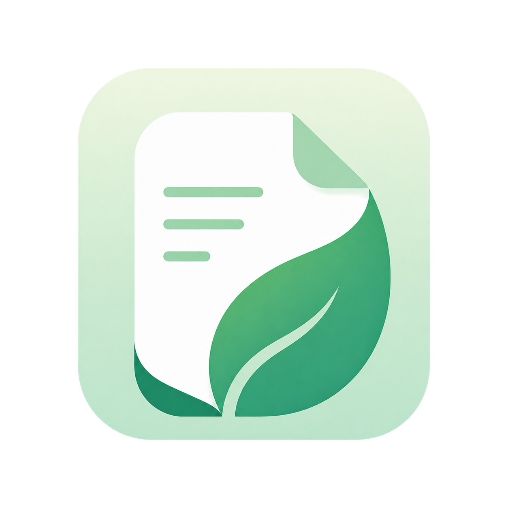

# Noteleaf

<p align="center">
  
</p>

Noteleaf is a polished, local-first notebook, daily task tracker, and Markdown workspace for Windows and macOS. Notes stay on your computer, save automatically, and can be protected with portable backups in a local, OneDrive, or Google Drive-synced folder.

Current release: **1.2.1**

See [CHANGELOG.md](CHANGELOG.md) for release notes.

## Highlights

- Organize notes into draggable notebooks, sections, sidebar pages, and linked child pages.
- Write rich notes with headings, lists, tables, links, code blocks, colored text, and edge-resizable images.
- Open individual Markdown files or browse a complete folder tree from a collapsible explorer.
- Pin an external Markdown file into any notebook section without copying it; the sidebar shortcut keeps relative links connected to neighboring files.
- Follow safe relative links between Markdown documents directly inside Noteleaf.
- Navigate page history and open tabs with working Back and Forward controls.
- Plan daily work in a dedicated Tasks workspace with To do, In progress, and Done states.
- Search across the local library, use focus mode, and switch efficiently from the keyboard.
- Create one-click backups and schedule hourly, daily, or weekly backups with configurable retention.
- Restore integrity-checked `.notesbackup` archives after an automatic safety backup.
- Turn on **AI access** once to automatically configure Claude Desktop, ChatGPT Desktop, and local Codex clients. Connected clients can search, read, and—when explicitly enabled—update notes and daily tasks without copy-paste or per-question scripts. ChatGPT on the web can use the same tools through OpenAI's optional private-tunnel flow.
- Select important text and use the shield button to protect it from accidental edits while keeping it selectable and copyable. Protected text is also omitted from MCP reads and search results. This is not encryption or a substitute for a password manager.
- Right-click an internal page to encrypt its title and contents with a session-locked password vault. Locked private pages show only a placeholder and are excluded completely from AI access.

See [docs/private-pages.md](docs/private-pages.md) for the encryption model and limitations, and [docs/mcp.md](docs/mcp.md) for MCP tools, the one-switch desktop setup, the optional ChatGPT web connection, and the AI security model.

## Keyboard shortcuts

| Action | Windows | macOS |
| --- | --- | --- |
| Search notes | `Ctrl+F` | `Command+F` |
| Toggle Tasks / notes | `Ctrl+T` | `Command+T` |
| Switch open tabs | `Ctrl+Tab` | `Command+Tab` |
| Toggle focus mode | `Ctrl+Shift+F` | `Command+Shift+F` |
| Open Settings | `Ctrl+,` | `Command+,` |
| Save external Markdown | `Ctrl+S` | `Command+S` |

## Install Noteleaf

These commands download the correct asset from the latest [GitHub release](https://github.com/bharathgedela/notes_app/releases), verify its SHA-256 checksum, and start Noteleaf. No Git, Node.js, or npm installation is required.

### Windows x64 — one command

Run in PowerShell:

```powershell
irm "https://raw.githubusercontent.com/bharathgedela/notes_app/main/scripts/install.ps1?$(New-Guid)" | iex
```

Complete the displayed Noteleaf setup wizard.

### macOS — one command

Run in Terminal. The script automatically selects Apple Silicon or Intel and installs Noteleaf in `~/Applications`:

```sh
curl -fsSL "https://raw.githubusercontent.com/bharathgedela/notes_app/main/scripts/install.sh?$(date +%s)" | sh
```

The bootstrap scripts are readable in [`scripts/install.ps1`](scripts/install.ps1) and [`scripts/install.sh`](scripts/install.sh) before running them. Until public builds are Developer ID signed and notarized, macOS may require choosing **Open** from Finder's context menu on first launch; unsigned Windows builds may similarly display SmartScreen.

## Development

Requirements: Node.js 22 and npm 10 or newer.

```sh
npm ci
npm run dev
```

Run the complete local verification suite:

```sh
npm run typecheck
npm run lint
npm test
npm run license:audit
npm run build
```

## Build installers

Windows x64 (run on Windows):

```powershell
npm run dist:win
```

macOS Apple Silicon or Intel (run on the corresponding Mac):

```sh
npm run dist:mac
npm run dist:mac:x64
```

Artifacts are written to `release/`. A pushed version tag runs the release workflow, publishes stable asset names and `SHA256SUMS.txt`, and makes the one-command installers work. macOS distribution outside the developer's machine should use Apple Developer ID signing and notarization. See [docs/releasing.md](docs/releasing.md) for the complete release checklist.

## Upgrading from Notes

Version 1.0.0 introduces the Noteleaf name and application identity. On first launch, Noteleaf copies an existing `Notes` data directory when a Noteleaf library does not already exist. The old directory remains untouched as a recovery copy. Backups named either `Notes-backup-…` or `Noteleaf-backup-…` remain discoverable and restorable.

## Open source and licensing

Noteleaf source code, documentation, and the original logo artwork are licensed under the [Apache License 2.0](LICENSE). Third-party dependency declarations are recorded in [THIRD_PARTY_NOTICES.md](THIRD_PARTY_NOTICES.md), with supplied license and notice texts in `THIRD_PARTY_LICENSES.txt`.

Before changing dependencies, run `npm run license:audit` and regenerate the inventory with `npm run license:notices`. See [docs/licensing.md](docs/licensing.md) for the project's compliance process. This repository's licensing material is engineering guidance and is not legal advice.

Contributions are welcome; read [CONTRIBUTING.md](CONTRIBUTING.md) and [SECURITY.md](SECURITY.md) first.
